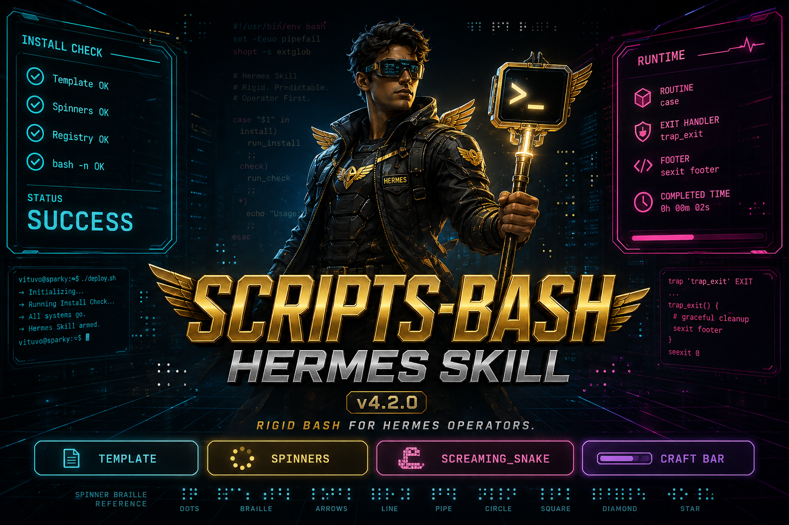

# scripts-bash

[](https://github.com/Unix-Dev-Ops/scripts-bash/actions/workflows/validate.yml)
[](https://github.com/NousResearch/hermes-agent)
[](#install)
[](LICENSE)

> **MCP gives Hermes tools. Skills give Hermes judgment. `scripts-bash` gives Hermes a standard for the bash that runs your stack.**

**Current skill version: v4.2.0**



## Why this exists

Hermes already orchestrates terminal, files, profiles, cron, and secrets. What it still needs for serious ops work is a **rigid house style** so every installer looks the same, fails cleanly, and reads like a product - not vibecode.

`scripts-bash` teaches Hermes (and you) to ship bash with:

| Pillar | What you get |
|--------|----------------|
| **Locked skeleton** | Header, colors, spinners, `ROUTINE` + `case`, `sexit` footer |
| **Stable names** | SCREAMING_SNAKE globals with a living registry |
| **Authoring recipe** | 5-step path from intent to verified script |
| **Craft bar** | Quote discipline, `[[ ]]`, dryrun, idempotent install, no secret dumps |
| **Lean package** | Skill law only - your host installers stay in your workspace |

Complements Hermes. Does not replace it. Does not claim to be a general "learn bash" course.

## Install (Hermes drop-in)

```bash
git clone https://github.com/Unix-Dev-Ops/scripts-bash.git
mkdir -p ~/.hermes/skills/software-development
cp -a scripts-bash/skills/software-development/scripts-bash \
  ~/.hermes/skills/software-development/
```

In a Hermes session:

```text
/reload-skills
/skill scripts-bash
```

Optional profile mirror (e.g. a coding profile):

```bash
cp -a ~/.hermes/skills/software-development/scripts-bash \
  ~/.hermes/profiles/<profile>/skills/
```

Standing rule (recommended in SOUL / AGENTS):

```text
For long-lived bash installer/manager scripts: load skill scripts-bash first.
Products go under profile workspace/installers/ or workspace/scripts/.
```

## Quickstart

```text
Load scripts-bash.
Copy templates/template-base.sh to workspace/installers/mytool/installer-mytool.sh
Purpose: manage mytool on port 9090.
Routines: install, update, start, stop, status, uninstall.
No sudo. Paths under ~/.hermes-programs/mytool/.
```

Then verify:

```bash
bash -n workspace/installers/mytool/installer-mytool.sh
# shellcheck if available
bash workspace/installers/mytool/installer-mytool.sh status
```

Full walkthrough: [`skills/software-development/scripts-bash/references/authoring.md`](skills/software-development/scripts-bash/references/authoring.md)

## Package layout

```text
skills/software-development/scripts-bash/
  SKILL.md
  templates/template-base.sh                    # ONLY executable skeleton
  references/screaming-snake-case-variables.md
  references/authoring.md
  README.md / PUBLISH.md
```

**Not in this repo:** private production installers, host design briefs, API keys, duplicate templates.

## What "good" looks like

- Author / Date / Ver / Name / Define header (column-aligned)
- Braille spinners + clean Ctrl+C (`SPINNER_PID` + trap)
- Green labels, cyan body, bright-red errors - cinematic `sleep 0.05` pacing
- `cmd_exit=$?` **before** `stop_spinner`
- `show_usage` exits 0 **without** the Completd footer; success paths end in `sexit`
- Prefer explicit failure checks on large installers (house style); do not blind-apply `set -e`

## Contributing

PRs welcome. Maintainer review required.

- [CONTRIBUTING.md](CONTRIBUTING.md) - workflow, checklist, conventional commits
- [MAINTAINERS.md](MAINTAINERS.md) - branch protection / merge style
- [SECURITY.md](SECURITY.md) - private vuln reports
- [CODEOWNERS](.github/CODEOWNERS) - `@Unix-Dev-Ops`

```bash
bash -n skills/software-development/scripts-bash/references/template-base.sh
bash -n skills/software-development/scripts-bash/templates/template-base.sh
bash -n skills/software-development/scripts-bash/examples/minimal-service-installer.sh
```

## Related

| Project | Role |
|---------|------|
| [Hermes Agent](https://github.com/NousResearch/hermes-agent) | The agent this skill serves |
| [Hermes docs](https://hermes-agent.nousresearch.com/docs) | Official documentation |
| Skills hub / local skills | Drop-in path under `~/.hermes/skills/` |

## Author

**Vituvo** ([@Unix-Dev-Ops](https://github.com/Unix-Dev-Ops))

Built for real Hermes operators who manage Docker, local inference, and agent infrastructure with bash that does not apologize.

## License

[MIT](LICENSE) - Copyright (c) 2026 Vituvo
